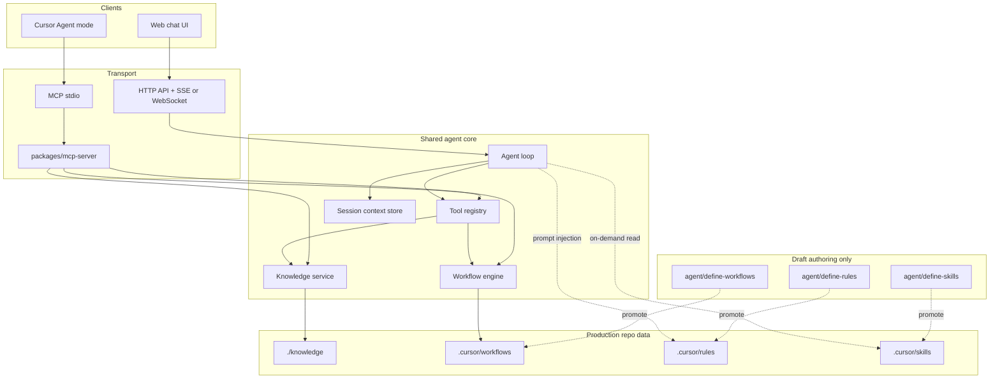
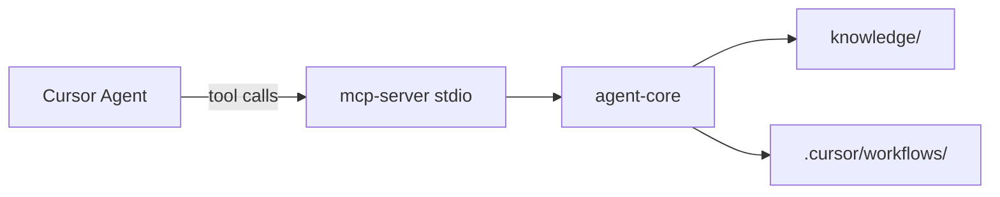

# Work Agent — technical architecture

Design for a product-discovery and strategy agent usable from **Cursor Agent mode** and from a **web chat UI**, with knowledge in `./knowledge`. Scope and intent: `agent/context.md`.

## Draft vs production folders

You **draft** rules, skills, and workflows as markdown under `agent/define-*`. The **runtime** reads only the production tree under `.cursor/` (plus `./knowledge` for domain content).

| Concern | Draft (authoring) | Production (runtime) |
| --- | --- | --- |
| Rules | `agent/define-rules/` | **`.cursor/rules/*.mdc`** |
| Skills | `agent/define-skills/` | **`.cursor/skills/<name>/SKILL.md`** |
| Workflows | `agent/define-workflows/` | **`.cursor/workflows/`** |

**Production folder for workflows:** **`.cursor/workflows/`** — validated workflow definitions (YAML) that Cursor Agent, MCP `workflow_list` / `workflow_run`, and the web agent core load and execute.

Draft workflow markdown in `agent/define-workflows/` is not executed directly. Promote to production by converting or copying into `.cursor/workflows/` (manual edit, or a future `make promote-workflows` script), then validate against `schema.workflow.json`.

Rules and skills follow the same pattern: edit drafts in `agent/define-*`, sync to `.cursor/rules` and `.cursor/skills` when ready (see `.cursor/rules/00-project-source-of-truth.mdc`).

## Design goals

| Goal | Implication |
| --- | --- |
| One agent, two clients | Shared runtime and tools; clients differ only in transport and session UX |
| Knowledge in repo files | `./knowledge` is canonical for domain facts; versioned, reviewable, no shadow copies |
| Workflows as data | **`.cursor/workflows/`** holds executable procedures; runtime interprets them instead of hard-coding each flow in code |
| Cursor-first iteration | Production rules/skills/workflows in `.cursor/`; MCP exposes the same capabilities the web app uses |
| Progressive complexity | Ship file-based knowledge + a small tool set before vector DB, subagents, or heavy orchestration |

## Non-goals (initial phases)

- Replacing Cursor’s built-in agent loop inside the IDE (we **extend** it with MCP and repo layout, not reimplement Composer)
- Multi-tenant SaaS auth, billing, or horizontal scale (defer until a web MVP proves value)
- Automatic sync to external KB layers (GitHub, Linear, Supabase) unless you add them explicitly per **knowledge-ops**

---

## High-level system view



**Principle (agent-builder):** the model drives the loop; code provides **capabilities**, **constraints**, and **clean context**—not a rigid script for every task.

---

## Dual-client model

### Cursor IDE / Agent mode

| Mechanism | Role |
| --- | --- |
| `.cursor/rules/*.mdc` | Always-on and file-scoped behavior (promoted from `agent/define-rules/`) |
| `.cursor/skills/*/SKILL.md` | On-demand playbooks (promoted from `agent/define-skills/`) |
| `.cursor/workflows/*` | Executable workflows (promoted from `agent/define-workflows/`) |
| `AGENTS.md` | Short entrypoint for humans and agents |
| **MCP server** | **`packages/mcp-server`** via **`.cursor/mcp.json`** — knowledge and workflow tools for Agent mode (see [MCP server](#mcp-server)) |

Cursor loads project rules and skills automatically. The **work-agent** MCP server exposes executable tools so IDE sessions match the web app’s knowledge and workflow behavior without reimplementing logic in prompts.

Setup: [`.cursor/MCP.md`](../.cursor/MCP.md). Operator config: [`.cursor/mcp.json`](../.cursor/mcp.json).

**Transport:** local **stdio** only for Cursor Desktop (**mcp-server-patterns**). Pin MCP SDK version; validate tool inputs with Zod (or equivalent). Do not expose stdio MCP to the browser.

### Web chat UI

| Layer | Responsibility |
| --- | --- |
| **Frontend** | Chat threads, streaming tokens, citations to `./knowledge` paths, workflow progress UI |
| **BFF / API** | Auth (when needed), rate limits, session IDs, streams model output |
| **Agent core** | Same loop and tools as MCP; no second implementation of workflow or knowledge logic |

**Transport:** **Streamable HTTP** (or SSE) from browser to your API; API calls the shared core in-process. Do not expose MCP stdio to the browser.

---

## MCP server

The **work-agent** MCP server is the Cursor-side adapter for repo-backed **knowledge** and **workflows**. It is required for parity between Agent mode and the future web chat (same tool contracts, same agent-core handlers).

### Placement in the repo

| Artifact | Path |
| --- | --- |
| MCP implementation | `packages/mcp-server/` |
| Shared domain logic | `packages/agent-core/` (knowledge service, workflow engine, tool handlers) |
| Cursor registration | `.cursor/mcp.json` → server name **`work-agent`** |
| Operator docs | `.cursor/MCP.md`, `packages/mcp-server/README.md` |

### Architecture



- **Thin adapter:** `packages/mcp-server` registers MCP tools, maps JSON args → agent-core calls, formats JSON results for the model.
- **No duplicate logic:** Web API imports the same agent-core modules; only transport differs (stdio vs HTTP).
- **Bootstrap:** Until the server is built, Cursor can still read `./knowledge` and production rules/skills as files; workflow execution and validated writes should go through MCP once available.

### Registration (Cursor)

Project file **`.cursor/mcp.json`**:

```json
{
  "mcpServers": {
    "work-agent": {
      "command": "node",
      "args": ["packages/mcp-server/dist/index.js"],
      "env": { "WORK_AGENT_ROOT": "." }
    }
  }
}
```

Set `WORK_AGENT_ROOT` to the repo root so paths resolve consistently. Enable **work-agent** under Cursor **Settings → MCP** after `dist/index.js` exists.

### Tool catalog (v1)

| MCP tool | agent-core handler | Data root |
| --- | --- | --- |
| `knowledge_search` | `KnowledgeService.search` | `./knowledge` |
| `knowledge_read` | `KnowledgeService.read` | `./knowledge` |
| `knowledge_write` | `KnowledgeService.write` | `./knowledge` |
| `workflow_list` | `WorkflowEngine.list` | `.cursor/workflows` |
| `workflow_run` | `WorkflowEngine.run` | `.cursor/workflows` + skills |

Each tool description must state failure modes (not found, validation error, read-only) so the model chooses correctly (**mcp-server-patterns**).

Optional later: MCP **resources** (`knowledge://…` URIs), **prompts** for common discovery templates, `workflow_status` for long runs.

### Session and workflow runs

- `workflow_run` accepts optional `session_id` for correlating step logs with web or IDE sessions.
- MCP does not replace Cursor’s chat history; it executes side effects and returns structured results the agent incorporates into the thread.

### Security (MCP)

| Topic | Rule |
| --- | --- |
| Transport | stdio only for desktop; trust boundary = local OS user |
| Path jail | Reads/writes only under `knowledge/` and workflow loads only from `.cursor/workflows/` |
| Secrets | Env-only API keys; never return in tool payloads |
| Errors | Structured `{ error, message }`; no stack traces to the client |
| Writes | Optional `WORK_AGENT_READ_ONLY=1` for MCP in shared machines |

### Observability

Log at MCP boundary: tool name, duration, workflow id, session id (no PII). Same events should be emitted when web API calls agent-core directly.

---

## Shared agent core

Single package/service (language choice: TypeScript or Python—pick one stack and reuse in MCP + API).

### Agent loop

```
LOOP:
  Build messages = system + session history + optional retrieved knowledge snippets
  Model chooses: respond | tool_call
  If tool_call: execute via Tool registry → append tool result → continue
  If respond: stream/return to client
  Enforce: max steps, timeout, token budget, allowed tool list
```

### Initial capability set (3–5 tools)

Start here; add tools only when the model repeatedly fails for lack of one.

| Tool | Purpose |
| --- | --- |
| `knowledge_search` | Query `./knowledge` (metadata + full-text; later semantic) |
| `knowledge_read` | Read one file or section by path |
| `knowledge_write` | Create/update with frontmatter validation and dedupe hints |
| `workflow_list` | Enumerate workflows from **`.cursor/workflows/`** |
| `workflow_run` | Execute a workflow by id with user-supplied inputs |

Optional later: `workflow_status`, subagent spawn, external research APIs.

### Context management

- **Session store:** MVP in-memory or SQLite keyed by `session_id`; web and MCP pass session id explicitly.
- **Truncation:** summarize or drop old tool payloads; keep user goals and recent workflow state.
- **Isolation:** long exploratory research → subagent or separate session (Level 3 in agent-builder), not unbounded main-thread dumps.

### Model and secrets

- API keys only in environment / secret store; never in `./knowledge`, client bundles, or MCP responses.
- Support at least one provider (e.g. Anthropic/OpenAI) via a thin adapter; log latency and token usage for later observability (**ai-architect-expert**).

---

## Knowledge subsystem (`./knowledge`)

Canonical **Layer 4 / local durable docs** in the knowledge-ops model: curated, git-tracked, human-editable.

### Layout (recommended)

```
knowledge/
  README.md                 # conventions, frontmatter schema
  _index.yaml               # optional catalog: id, path, tags, updated_at
  domains/                  # unset until user picks a domain; placeholder ok
  methods/                  # personas, BRD templates, discovery frameworks
  insights/                 # synthesized findings (dated)
  references/               # external sources, summaries
  sessions/                 # optional exports from chat (redacted)
```

### File format

- **Markdown** with YAML frontmatter: `id`, `title`, `tags`, `created`, `updated`, `source`, `related[]`.
- Stable **kebab-case** filenames; `id` in frontmatter matches workflow and citation references.

### Knowledge service behavior

| Operation | MVP | Production extension |
| --- | --- | --- |
| Search | Ripgrep / SQLite FTS on frontmatter + body | Hybrid BM25 + embeddings (**rag-implementation**); local Chroma or pgvector |
| Read | Path-safe read (jail to `knowledge/`) | Same + chunk citations |
| Write | Validate schema, update `_index.yaml`, dedupe by `id`/title search | Async re-index embeddings |
| Classify | Route writes using knowledge-ops rules (insight vs method vs session) | Optional MCP memory graph for cross-repo search |

**Quality gate (knowledge-ops):** search before create; redact secrets; one canonical path per fact set; update index when adding files.

### Cursor without MCP (bootstrap)

Agents can read `./knowledge` via workspace files. Use **work-agent** MCP when you need validated `knowledge_write`, search parity with the web app, or `workflow_run` against `.cursor/workflows/`.

---

## Workflow subsystem

Workflows are **declarative recipes** the runtime executes. They compose skills, tools, and prompts—not a replacement for the model’s reasoning on ambiguous discovery work.

### Draft layout (`agent/define-workflows/`)

Markdown (and notes) you iterate on before promotion. Not loaded by the workflow engine.

```
agent/define-workflows/
  README.md                 # how to author and promote
  market-scan.md            # example draft
```

### Production layout (`.cursor/workflows/`)

```
.cursor/workflows/
  README.md                 # schema version, runtime conventions
  schema.workflow.json      # JSON Schema for validation (CI)
  discovery/
    market-scan.yaml
  strategy/
    persona-draft.yaml
```

### Workflow document (conceptual schema)

```yaml
id: market-scan
version: 1
title: Market scan for an innovation theme
description: When to use this workflow (for model + humans)
inputs:
  - name: theme
    type: string
    required: true
  - name: geography
    type: string
    required: false
steps:
  - id: gather
    type: skill
    ref: research-ops          # maps to .cursor/skills/research-ops/SKILL.md
    with: { focus: "{{inputs.theme}}" }
  - id: synthesize
    type: prompt
    template: prompts/synthesize-insight.md
  - id: persist
    type: tool
    tool: knowledge_write
    with:
      path: insights/{{date}}-{{inputs.theme}}.md
      template: templates/insight.md
outputs:
  - knowledge_path
  - summary
```

### Step types (MVP → later)

| Type | Behavior |
| --- | --- |
| `tool` | Invoke registered tool with templated args |
| `skill` | Load skill markdown into context; model executes with guardrails |
| `prompt` | Run a single model turn with a template |
| `branch` | Conditional on prior step output (later) |
| `parallel` | Fan-out sub-steps (later) |

### Workflow engine

1. Load and validate YAML from **`.cursor/workflows/`** against schema.
2. Resolve `inputs` from caller (web form or MCP args).
3. For each step: dispatch to tool adapter or inject skill/prompt; capture structured **step result**.
4. Emit events: `step_started`, `step_completed`, `workflow_failed` (for web UI progress).
5. **Do not** encode domain-specific discovery logic only in Python/TS—keep it in workflow + knowledge + skills.

### Relationship to `.cursor/skills`

| Asset | Role |
| --- | --- |
| Skill | Reusable expertise and procedure text |
| Workflow | Ordered composition with inputs/outputs and persistence hooks |
| Rule | Global constraints (tone, done gates) |

Workflow `skill` steps should reference project skills under `.cursor/skills/` by folder name.

---

## Component map (implementation)

Suggested repo layout when you scaffold code (names flexible):

```
/
  knowledge/
  agent/
    architecture.md
    context.md
    define-rules/           # draft only
    define-skills/          # draft only
    define-workflows/       # draft only
  .cursor/
    mcp.json                  # Cursor MCP registration (work-agent)
    MCP.md                    # enable / troubleshoot MCP
    rules/                  # production
    skills/                 # production
    workflows/              # production
  packages/
    agent-core/             # knowledge + workflow engine (shared)
    mcp-server/             # stdio MCP → agent-core
  apps/
    web/                   # Next.js (or similar): chat UI + API routes
  adr/                     # architecture decisions (retrospective)
```

**Makefile** (when code exists): `dev` (web + API), `up` (background stack), `down`, `test`, `lint` per project rules.

---

## Request flows

### Run workflow from Cursor

1. User asks to run a named workflow in Agent mode.
2. Ensure **work-agent** MCP is enabled (`.cursor/mcp.json`).
3. Cursor agent invokes MCP `workflow_run({ id, inputs, session_id })`.
4. `packages/mcp-server` delegates to agent-core; loads YAML from **`.cursor/workflows/`**, runs steps, may call `knowledge_write`.
5. Results returned as structured JSON + markdown summary in chat.

### Knowledge from Cursor

1. Prefer MCP `knowledge_search` / `knowledge_read` for grounded answers with consistent path rules.
2. Use `knowledge_write` to persist insights to `./knowledge` with frontmatter validation.
3. Direct file edits in `./knowledge` remain valid; MCP write path keeps index and schema in sync when implemented.

### Chat from web

1. Browser POST `/api/chat` with message + `session_id`.
2. API runs agent loop with same tools; streams assistant tokens.
3. UI shows citations when `knowledge_read` / search snippets are attached to the turn.
4. Optional: “Run workflow” button maps to `workflow_run` with form inputs.

### Ingest knowledge manually

1. User edits files in `./knowledge` or asks agent to save a summary.
2. `knowledge_write` validates frontmatter, updates `_index.yaml`.
3. CI job validates frontmatter + schema; optional rebuild of search index.

---

## Security and safety

| Area | Requirement |
| --- | --- |
| Path traversal | File tools jail to `knowledge/` and **`.cursor/workflows/`** only (not `agent/define-*`) |
| Secrets | Never write API keys or credentials into knowledge files; scan on commit |
| MCP / API auth | Local MCP trusts OS user; HTTP API needs auth before any public deploy |
| Tool errors | Structured messages to model; no stack traces or internal paths to clients |
| Write policy | Configurable read-only mode for production web; IDE may allow writes |

---

## Observability (phased)

| Phase | What to log |
| --- | --- |
| MVP | Workflow id, step timings, tool names, session id (no PII in logs) |
| Production | Token/cost per session, retrieval hit rate, workflow success/failure, model version |

Align metrics with **ai-architect-expert**: latency, quality, cost—before adding Kubeflow-scale infrastructure.

---

## Delivery phases

| Phase | Deliverable | Client support |
| --- | --- | --- |
| **0 — Spec** | Docs + `knowledge/`, `.cursor/workflows/` placeholders + `.cursor/mcp.json` | Cursor rules/skills; MCP stub documented |
| **1 — Core + MCP** | `agent-core` + `packages/mcp-server` (5 tools, stdio) | Cursor Agent via **work-agent** MCP |
| **2 — Web MVP** | Chat UI + API streaming + shared core | Browser users |
| **3 — Retrieval** | FTS or embedding index over `./knowledge` | Better grounding + citations |
| **4 — Hardening** | Auth, rate limits, eval harness for workflows | Shared / team use |

Complete **one phase to DoD** before expanding scope (**incremental-delivery**).

---

## ADR candidates (record under `./adr/` when decided)

1. **Language for agent-core** (TypeScript vs Python) — affects MCP SDK choice and web sharing.
2. **Workflow schema version** and whether steps allow free-form model turns vs tool-only steps.
3. **Search MVP**: ripgrep/FTS vs immediate vector store for `./knowledge`.
4. **Session persistence**: SQLite vs Postgres when web goes multi-user.
5. **Web stack**: Next.js App Router + API routes vs separate FastAPI service.
6. **MCP SDK and monorepo layout** — TypeScript `@modelcontextprotocol/sdk` vs Python MCP; single package vs workspace.

---

## Summary

- **Draft** under `agent/define-rules`, `agent/define-skills`, `agent/define-workflows`; **production** under `.cursor/rules`, `.cursor/skills`, and **`.cursor/workflows/`**.
- **MCP server:** **`packages/mcp-server`**, registered as **`work-agent`** in **`.cursor/mcp.json`**, stdio transport, five tools over **agent-core** (`knowledge_*`, `workflow_list`, `workflow_run`). See **`.cursor/MCP.md`**.
- **Cursor** uses production rules/skills plus **work-agent** MCP for knowledge and workflows; **web** uses the same agent-core via HTTP API.
- **`./knowledge`** holds canonical, git-tracked domain and method knowledge.
- Implement MCP + core before web chat so both clients share one tool implementation.
